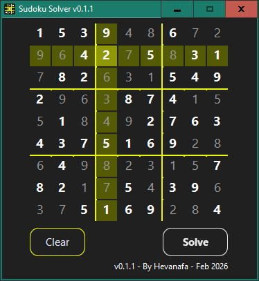

# Sudoku Solver

A fast and convenient Sudoku puzzle solver written in Object Pascal

Before solving:

After solving:

## Usage

1. Enter numbers into the empty cells
2. Click **Solve** to let the algorithm fill in the rest
3. Bolded cells show the solver's solution
4. Click **Clear** to start over

## Requirements

- Lazarus IDE (v3.6 by the time of writing)

### Online Packages

- [BGRAControls](https://github.com/bgrabitmap/bgracontrols)

You can install additional online packages by **Package > Online Package Manager** in Lazarus

## Building

1. Open `project.lpi` with Lazarus IDE
2. Change the build mode to **Release**
3. Make with **Run > Compile** (also by `Ctrl+F9`)
